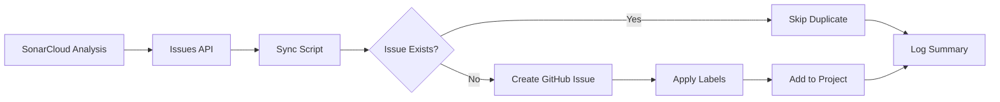

# SonarCloud → GitHub Issues Synchronization

> 🔄 Automated synchronization of SonarCloud issues to GitHub Issues

This document explains how the SonarCloud → GitHub Issues synchronization works, how to configure it, and how to use it effectively.

---

## 📋 Table of Contents

- [Overview](#overview)
- [How It Works](#how-it-works)
- [Configuration](#configuration)
- [Usage](#usage)
- [Customization](#customization)
- [Troubleshooting](#troubleshooting)
- [FAQ](#faq)

---

## 🎯 Overview

The SonarCloud sync automation centralizes all code quality issues detected by SonarCloud directly into GitHub Issues, making it easier to:

- **Track** bugs, vulnerabilities, and code smells in one place
- **Assign** issues to team members
- **Prioritize** work based on severity
- **Monitor** progress with GitHub's project boards
- **Automate** issue creation without manual work

### Key Features

✅ **Automatic Detection** - Fetches issues from SonarCloud API  
✅ **Smart Deduplication** - Avoids creating duplicate issues  
✅ **Rich Formatting** - Issues include severity, type, location, and links  
✅ **Auto-Labeling** - Applies relevant labels (bug, security, priority)  
✅ **Scheduled Runs** - Runs weekly on Mondays at 12:00 UTC  
✅ **Manual Trigger** - Can be run on-demand via GitHub Actions  
✅ **Dry Run Mode** - Preview changes without creating issues  

---

## 🔄 How It Works



### Workflow Steps

1. **Trigger** - Workflow starts (scheduled or manual)
2. **Fetch** - Script queries SonarCloud API for open issues
3. **Filter** - Applies severity and type filters
4. **Check** - Verifies if issue already exists in GitHub
5. **Create** - Creates new GitHub Issue with rich details
6. **Label** - Applies automatic labels based on severity/type
7. **Report** - Generates summary of sync operation

---

## ⚙️ Configuration

### 1. Required Secrets

Add these secrets to your GitHub repository (`Settings → Secrets and variables → Actions → New repository secret`):

| Secret | Description | How to Get |
|--------|-------------|------------|
| `SONAR_TOKEN` | SonarCloud authentication token | [SonarCloud Account → Security](https://sonarcloud.io/account/security) |
| `SONAR_ORG` | SonarCloud organization key | Found in SonarCloud project URL |
| `SONAR_PROJECT` | SonarCloud project key | Found in SonarCloud project settings |

**Note:** `GITHUB_TOKEN` is automatically provided by GitHub Actions.

### 2. Get Your SonarCloud Token

1. Go to https://sonarcloud.io/account/security
2. Generate a new token with name: `GitHub Issues Sync`
3. Copy the token (you won't see it again!)
4. Add it as `SONAR_TOKEN` secret in GitHub

### 3. Find Your Organization and Project Keys

**SonarCloud URL structure:**
```
https://sonarcloud.io/project/overview?id={ORG}_{PROJECT}
```

**Example:**
```
https://sonarcloud.io/project/overview?id=felipemacedo1_ktar
                                        └─────┬─────┘ └─┬─┘
                                           SONAR_ORG   PROJECT
```

For the KTAR project:
- `SONAR_ORG` = `felipemacedo1`
- `SONAR_PROJECT` = `felipemacedo1_ktar`

---

## 🚀 Usage

### Automatic Execution (Scheduled)

The workflow runs **automatically every Monday at 12:00 UTC**.

No action required! 🎉

### Manual Execution

1. Go to **Actions** tab in your repository
2. Select **SonarCloud Issues Sync** workflow
3. Click **Run workflow**
4. Configure options (optional):
   - **Severities**: `BLOCKER,CRITICAL,MAJOR` (default)
   - **Types**: `BUG,VULNERABILITY,CODE_SMELL,SECURITY_HOTSPOT` (default)
   - **Dry Run**: `false` (set to `true` to preview without creating)
5. Click **Run workflow**

### Command Line Execution (Local)

You can also run the script locally:

```bash
# Export environment variables
export SONAR_ORG="felipemacedo1"
export SONAR_PROJECT="felipemacedo1_ktar"
export SONAR_TOKEN="your-sonar-token"
export GH_TOKEN="your-github-token"  # or use: gh auth login

# Run the script
./scripts/sync_sonar_issues.sh

# Dry run (preview only)
./scripts/sync_sonar_issues.sh --dry-run

# Custom filters
./scripts/sync_sonar_issues.sh --severities=BLOCKER,CRITICAL --types=BUG,VULNERABILITY
```

---

## 🎨 Customization

### Filtering by Severity

Available severity levels:
- `BLOCKER` 🚨 - Must be fixed immediately
- `CRITICAL` 🔴 - High priority
- `MAJOR` 🟠 - Medium priority
- `MINOR` 🟡 - Low priority
- `INFO` ℹ️ - Informational

**Example:**
```bash
./scripts/sync_sonar_issues.sh --severities=BLOCKER,CRITICAL
```

### Filtering by Type

Available issue types:
- `BUG` 🐛 - Code defects
- `VULNERABILITY` 🔓 - Security issues
- `CODE_SMELL` 👃 - Maintainability issues
- `SECURITY_HOTSPOT` 🔥 - Security-sensitive code

**Example:**
```bash
./scripts/sync_sonar_issues.sh --types=BUG,VULNERABILITY
```

### Automatic Labels Applied

| Condition | Labels Applied |
|-----------|----------------|
| Type = BUG | `sonarcloud`, `bug` |
| Type = VULNERABILITY | `sonarcloud`, `security`, `vulnerability` |
| Type = CODE_SMELL | `sonarcloud`, `code-quality` |
| Type = SECURITY_HOTSPOT | `sonarcloud`, `security`, `security-hotspot` |
| Severity = BLOCKER/CRITICAL | `priority:high` |
| Severity = MAJOR | `priority:medium` |
| Severity = MINOR/INFO | `priority:low` |

### Customizing the Workflow Schedule

Edit `.github/workflows/sonar-sync.yml`:

```yaml
on:
  schedule:
    # Run daily at 9 AM UTC
    - cron: '0 9 * * *'
    
    # Run twice a week (Monday and Thursday at 12 PM UTC)
    - cron: '0 12 * * 1,4'
```

[Cron schedule reference](https://crontab.guru/)

---

## 🐛 Troubleshooting

### Issue: Script fails with "Missing required dependencies"

**Solution:**
```bash
# Install missing dependencies
sudo apt-get update
sudo apt-get install -y curl jq

# Install GitHub CLI
curl -fsSL https://cli.github.com/packages/githubcli-archive-keyring.gpg | sudo dd of=/usr/share/keyrings/githubcli-archive-keyring.gpg
echo "deb [arch=$(dpkg --print-architecture) signed-by=/usr/share/keyrings/githubcli-archive-keyring.gpg] https://cli.github.com/packages stable main" | sudo tee /etc/apt/sources.list.d/github-cli.list > /dev/null
sudo apt-get update
sudo apt-get install gh -y
```

### Issue: "Invalid JSON response from SonarCloud API"

**Possible causes:**
1. Invalid `SONAR_TOKEN`
2. Invalid `SONAR_ORG` or `SONAR_PROJECT`
3. Network connectivity issues

**Solution:**
```bash
# Test SonarCloud API manually
curl -u "${SONAR_TOKEN}:" \
  "https://sonarcloud.io/api/issues/search?componentKeys=${SONAR_ORG}_${SONAR_PROJECT}&ps=1"
```

Expected response:
```json
{
  "total": 5,
  "p": 1,
  "ps": 1,
  "paging": {...},
  "issues": [...]
}
```

### Issue: "Failed to create issue" in GitHub

**Possible causes:**
1. `GH_TOKEN` not set or invalid
2. Repository permissions insufficient
3. Label doesn't exist

**Solution:**
```bash
# Authenticate GitHub CLI
gh auth login

# Create missing labels manually
gh label create "sonarcloud" --color "0052CC" --description "Issues from SonarCloud"
gh label create "code-quality" --color "FFA500" --description "Code quality issues"
gh label create "priority:high" --color "DC143C" --description "High priority"
gh label create "priority:medium" --color "FFA500" --description "Medium priority"
gh label create "priority:low" --color "FFFF00" --description "Low priority"
```

### Issue: Duplicate issues being created

The script should automatically detect duplicates. If duplicates are created:

1. Check if issues have the `sonarcloud` label
2. Verify title format matches: `[SonarCloud] [SEVERITY] message`

**Manual cleanup:**
```bash
# List all SonarCloud issues
gh issue list --label "sonarcloud"

# Close duplicates
gh issue close <issue_number> --comment "Duplicate issue"
```

---

## ❓ FAQ

### Q: How often should I run the sync?

**A:** Weekly is recommended for most projects. Critical projects may benefit from daily syncs.

### Q: Will old issues be closed automatically?

**A:** No, the script only creates issues. You need to manually close resolved issues or implement a bidirectional sync.

### Q: Can I customize the issue template?

**A:** Yes! Edit the `create_github_issue()` function in `scripts/sync_sonar_issues.sh`.

### Q: What happens if I delete a GitHub issue?

**A:** It will be recreated on the next sync. Mark issues as resolved in SonarCloud to prevent recreation.

### Q: Can I sync to multiple repositories?

**A:** Yes, but you'll need to run separate workflows/scripts for each repository.

### Q: How do I stop syncing certain types of issues?

**A:** Use filters in the workflow:
```yaml
severities: 'BLOCKER,CRITICAL'  # Only critical issues
types: 'BUG,VULNERABILITY'       # Only bugs and vulnerabilities
```

### Q: Can I sync issues from multiple SonarCloud projects?

**A:** Not with the current script. You'd need to modify it to loop through multiple projects.

---

## 🔗 Related Documentation

- [SonarCloud API Documentation](https://sonarcloud.io/web_api)
- [GitHub Issues API](https://docs.github.com/en/rest/issues)
- [GitHub CLI Manual](https://cli.github.com/manual/)
- [GitHub Actions Workflow Syntax](https://docs.github.com/en/actions/using-workflows/workflow-syntax-for-github-actions)

---

## 📝 Example Issue

Here's what a synced issue looks like:

### Title
```
[SonarCloud] [MAJOR] Remove this unused import 'java.util.ArrayList'
```

### Body
```markdown
## 🟠 👃 SonarCloud Issue

**Severity:** `MAJOR`  
**Type:** `CODE_SMELL`  
**Rule:** `java:S1128`  
**Effort:** `5min`

---

### 📄 Location
**File:** `app/src/main/java/com/ktar/MainActivity.kt`  
**Line:** `42`

---

### 📋 Message
Remove this unused import 'java.util.ArrayList'

---

### 🔗 Links
- [View in SonarCloud](https://sonarcloud.io/project/issues?open=AY...)
- [Rule Documentation](https://rules.sonarsource.com/java/RSPEC-1128)

---

> 🤖 This issue was automatically created by SonarCloud sync workflow.  
> 📅 Created: 2025-10-26 12:00:00 UTC
```

### Labels
- `sonarcloud`
- `code-quality`
- `priority:medium`

---

## 🤝 Contributing

Found a bug or have a suggestion? Please:

1. Check existing issues
2. Create a new issue with the `sonarcloud-sync` label
3. Submit a pull request

---

## 📄 License

This sync automation follows the same license as the main project.

---

**Last Updated:** 2025-10-26  
**Maintained by:** KTAR Team  
**Version:** 1.0.0
